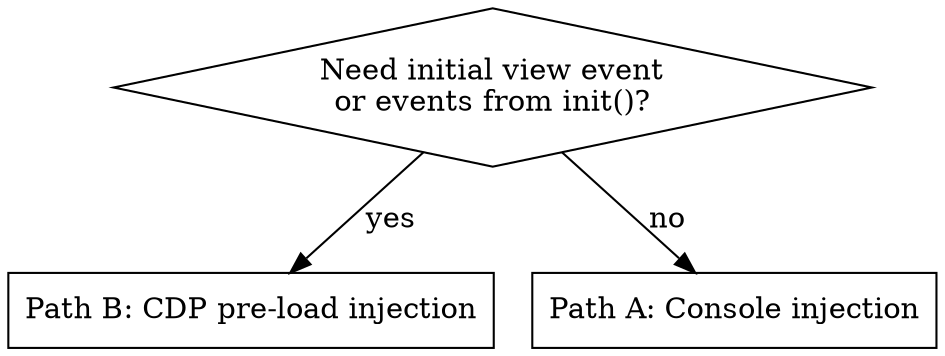

# Datadog Browser SDK — Event Inspection

## Overview

The SDK calls `window.__ddBrowserSdkExtensionCallback(msg)` for every event before
batching. Setting this callback captures full event payloads before they reach intake.

**Core principle:** Set the callback BEFORE the SDK emits the event you want to inspect.

**Do not use network request interception for this.** Events are not flushed immediately (view events only finalize on navigation/session end). The callback approach is reliable and gives you events the moment they are emitted.

## When to Use

- Verifying a change emits the correct event type or fields
- Checking custom attributes or user attributes appear on an event
- Debugging why an action/error/log was or wasn't captured
- Validating SDK behavior in the sandbox (`yarn dev` → `http://localhost:8080`)

## Setup — Choose Your Injection Path



### Path A — Console Injection (post-load events only)

For actions, errors, logs, and events triggered **after** the page has fully loaded.

Paste in the DevTools console after the page loads:

```js
window.__ddBrowserSdkExtensionCallback = (msg) => {
  console.log('[SDK Event]', JSON.stringify(msg))
}
```

Then trigger the interaction. Read `[SDK Event]` lines from console output.

### Path B — CDP Pre-load Injection (initial view + events from init)

The sandbox calls `DD_RUM.init()` synchronously in `<head>`. The initial view event fires during page load — before any post-load console injection runs.

**Before navigating**, call the `Page.addScriptToEvaluateOnNewDocument` CDP command via the chrome_devtools MCP. This is a protocol-level call — NOT JavaScript to paste in the console.

The script source to inject:

```js
window.__ddBrowserSdkExtensionCallback = (msg) => {
  console.log('[SDK Event]', JSON.stringify(msg))
}
```

Invoke it via the MCP (exact tool name varies — check available tools, look for `Page.addScriptToEvaluateOnNewDocument` or a generic `execute_cdp_command`):

```
Tool: Page.addScriptToEvaluateOnNewDocument (or equivalent)
Params: { source: "window.__ddBrowserSdkExtensionCallback = (msg) => { console.log('[SDK Event]', JSON.stringify(msg)) }" }
```

Then navigate to `http://localhost:8080`. Every event — including the initial view — will appear in console logs.

**Do not inject via console and then reload.** Reloading clears the injected console code.

## Event Message Structure

```
{ type: 'rum',       payload: RumEvent }       // view, action, error, resource, long_task
{ type: 'logs',      payload: LogsEvent }
{ type: 'telemetry', payload: TelemetryEvent }
{ type: 'record',    payload: { record, segment } }  // Session Replay only
```

## Key Fields Quick Reference

| What to check | Field path |
|---|---|
| Event category | `msg.type` |
| RUM sub-type | `msg.payload.type` |
| User attribute (via `setUser`) | `msg.payload.usr.<key>` |
| Global context attribute (via `addRumGlobalContext`) | `msg.payload.context.<key>` |
| Action name | `msg.payload.action.target.name` |
| Error message | `msg.payload.error.message` |
| View URL | `msg.payload.view.url` |
| Log message | `msg.payload.message` |
| Telemetry status | `msg.payload.telemetry.status` |

Note: user attributes use `usr` (not `user`) in the serialized payload.

## Flush Caveat

**View events are only finalized when the view ends** (navigation or session end).
The initial view event will be updated multiple times as the page runs — earlier emissions are incomplete.

To get the final view event: trigger a navigation, or call `window.DD_RUM.stopSession()` in the console (note: this permanently ends the current session — only use for debugging).

## Common Mistakes

| Mistake | Fix |
|---|---|
| Using network requests to verify events | Events may not be flushed yet; use the callback instead |
| Console injection + reload to capture early events | Reload clears injected code — use Path B (CDP pre-load) |
| Missing the initial view event | Use Path B: `Page.addScriptToEvaluateOnNewDocument` before navigating |
| Seeing no `[SDK Event]` logs after reload | The callback was cleared by reload — re-run Path B setup |
| Incomplete view event data | View updates until view ends — navigate away or call `stopSession()` |
| Looking for `user.plan` in payload | It's `usr.plan` in serialized RUM events |