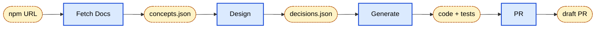

# Router Integration Pipeline

**One command in, draft PR out.**

Takes an npm URL like `vue-router`, produces a full Browser SDK router integration.

---

## Context

- Many integration we build so far follow the same pattern (React, Angular, ...)
- Repetitive, pattern-heavy work → good automation candidate
- Scoped to **one feature** (route-pattern view naming) to stay practical and shippable
- **What's a router integration?** RUM tracks views (one per navigation). Default view name = raw URL, so `/users/42` and `/users/1337` look like different pages. Customers' routers use **patterns** (`/users/:id`) — integration hooks the router so the view name is the _pattern_, aggregating cleanly in dashboards.

---

## The Flow

4 stages, each a separate `claude -p` process:

1. **Fetch docs** → schema-validated JSON of routing concepts
2. **Design** → schema-validated design decisions
3. **Generate** → TypeScript code + tests, self-validates
4. **PR** → commits, pushes, opens draft

---

## AI Guidelines That Made It Work

### Isolated context per stage

Fresh `claude -p` each step. No context bloat, no cross-contamination, cheaper tokens.

### Structured data between stages

`--json-schema` enforced by the harness. Downstream stages `jq` into guaranteed shapes instead of parsing prose. Hallucinations caught at the boundary.

### Reference implementations as ground truth

Stage 2 reads existing React/Angular integrations before designing. The model pattern-matches against _working code_, not its own priors.

### Harness-enforced validation, not vibes

Schema validation on JSON stages, typecheck/lint gate on codegen. Pipeline _stops_ on failure rather than producing plausible-looking garbage.

### Persisted artifacts at every boundary

`docs/integrations/<framework>/` holds each stage's output. Reviewable, resumable, debuggable. You can rerun stage 3 without redoing 1-2.

### Narrow, composable skills

Each stage is its own slash command. Testable in isolation, orchestrator just sequences them.

---

## Net

**Structured hand-offs between focused agents, grounded in real code, validated by the harness.**

---

## Lessons Learned

- **Many ways to orchestrate agents** — skills, subagents, `claude -p` CLI, raw API. Each has different trade-offs (context isolation, composability, cost, observability). Pick deliberately per stage.
- **Read the actual Claude docs** — I tried asking Claude about its own best practices and got vague/inconclusive answers. Docs are the source of truth.
- **Building this takes time** — each stage has to be developed in isolation, iteration is slow, lots of manual review of intermediate outputs early on. The upfront cost is real.
- **Next: self-prompt improvement** — want to experiment with letting the pipeline refine its own prompts from review feedback, instead of me tuning them by hand.
