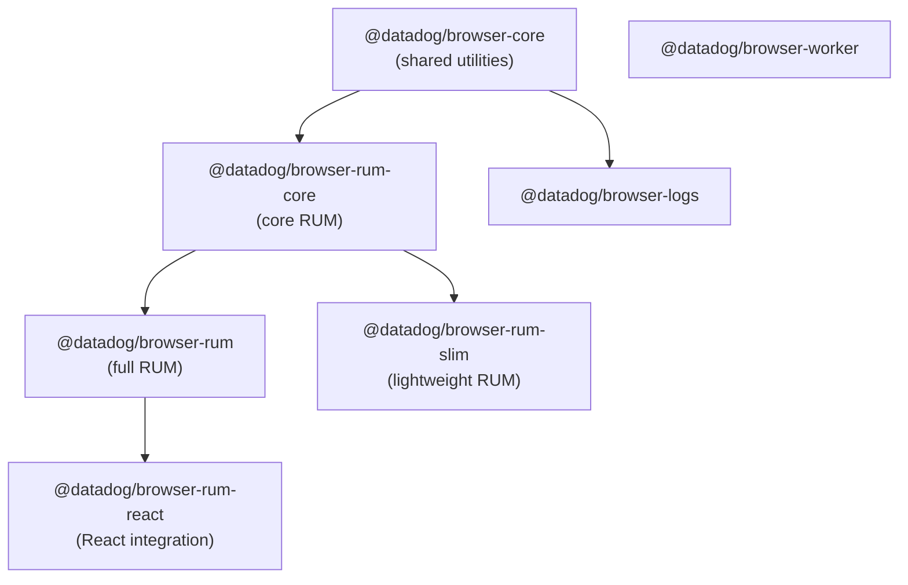
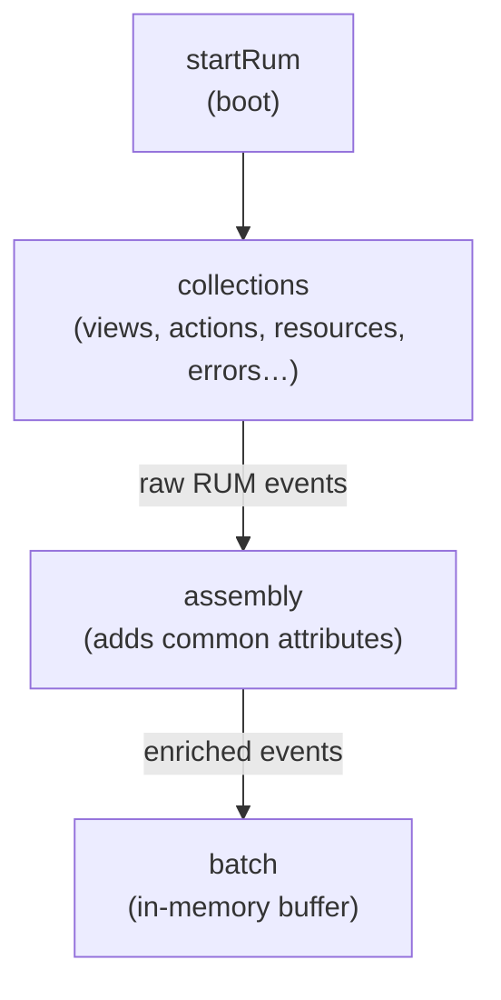
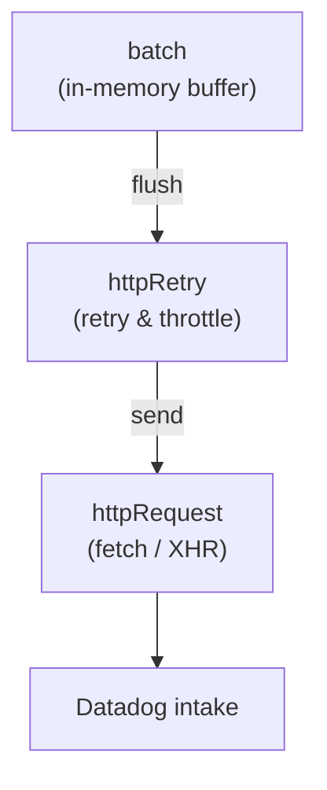

# Architecture

Describes architecture patterns with examples — detailed component documentation lives as JSDoc on the files themselves.

## Package dependencies

The [monorepo](https://github.com/DataDog/browser-sdk) contains several packages:

## Data processing

High-level view of RUM SDK data processing. Each box represents a module:

### startRum [[code](https://github.com/DataDog/browser-sdk/blob/32ffe4bb7e50a37a43794773bbbc57aabb373468/packages/rum-core/src/boot/startRum.ts)]

Called at SDK initialization. Starts all event data collection.

### collection [[code](https://github.com/DataDog/browser-sdk/blob/32ffe4bb7e50a37a43794773bbbc57aabb373468/packages/rum-core/src/domain/rumEventsCollection/error/errorCollection.ts)]

Creates raw RUM events (`views`, `actions`, `resources`, …) by listening to or instrumenting various web APIs, then notifies the assembly.

### assembly [[code](https://github.com/DataDog/browser-sdk/blob/32ffe4bb7e50a37a43794773bbbc57aabb373468/packages/rum-core/src/domain/assembly.ts)]

Enriches each event with common attributes (`applicationId`, `service`, `version`, view context, customer context, …) then forwards it to the batch.

## Data transfer

### batch [[code](https://github.com/DataDog/browser-sdk/blob/32ffe4bb7e50a37a43794773bbbc57aabb373468/packages/core/src/transport/batch.ts)]

Collects events into an in-memory batch. Flushed:

- Periodically, every `configuration.flushTimeout` (30s by default)
- When the buffer size reaches `configuration.batchBytesLimit`
- When the number of events reaches `configuration.maxBatchSize`
- On `visibilitychange` when the document becomes hidden
- On `beforeunload`

### httpRetry

Buffers and retries failed requests (`network failure`, `intake unavailable`, `no connectivity`, …). Also throttles requests when too many are in progress.

The SDK buffers at most 3MB of requests; older requests are dropped beyond that limit. The buffer is in-memory — requests are lost if the tab is closed.

### httpRequest [[code](https://github.com/DataDog/browser-sdk/blob/32ffe4bb7e50a37a43794773bbbc57aabb373468/packages/core/src/transport/httpRequest.ts)]

Sends events using `fetch` with `keepAlive`, falling back to `XMLHttpRequest`.
