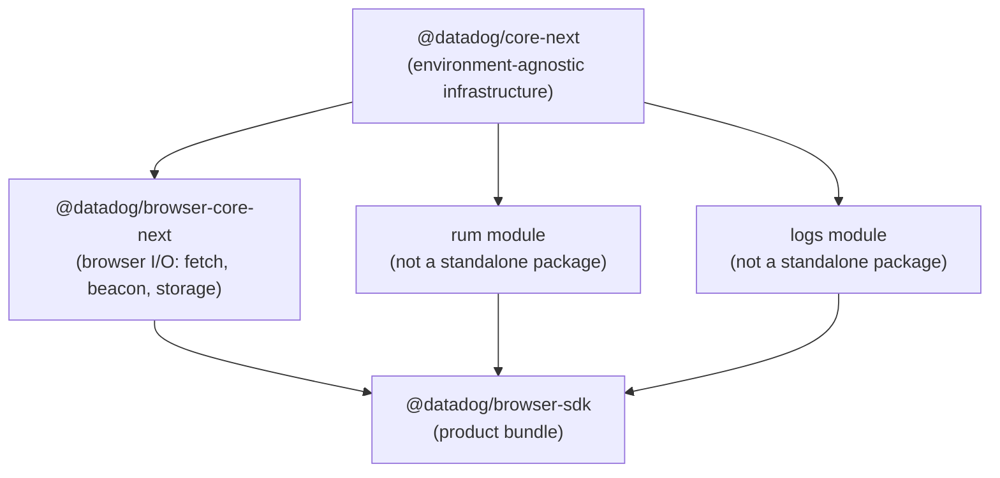
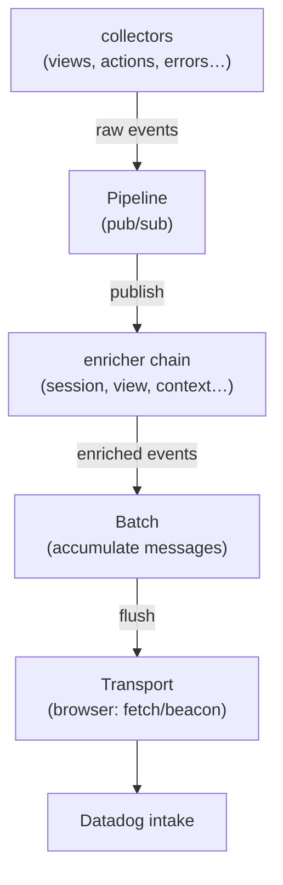

# Architecture v8

Documents the new SDK architecture being built in the `*-next` packages.

## Core principles

- **Environment-agnostic core** — `core-next` has zero browser dependencies. Browser-specific I/O lives in `browser-core-next`.
- **Modules, not packages** — RUM, Logs, and other products are modules loaded into a single SDK, not standalone packages.
- **Pipeline-based processing** — events flow through an enricher chain (DAG-ordered) before reaching the transport.
- **Classes allowed** — `*-next` packages use class-based architecture for interface implementations (unlike legacy packages).

## Package structure



## Initialization

The user calls a single `init()` with a flat config. Module keys drive which modules are loaded:

```ts
sdk.init({
  clientToken: 'abc',
  site: 'datadoghq.com',
  rum: { applicationId: 'xyz', trackUserInteractions: true },
  logs: { forwardErrorsToLogs: true },
})
```

- The presence of a module key (e.g. `rum: { ... }`) activates that module automatically.
- An empty object (e.g. `rum: {}`) is enough to activate a module with defaults.
- If a module key is absent, the module is skipped.

### Module loading strategy (open decision)

Two approaches are under consideration:

- **Code splitting** — modules are part of the same bundle but lazy-loaded via dynamic `import()`. Simpler for developers, standard bundler feature, full type safety at compile time.
- **Remote loading** — modules are separate scripts fetched from a CDN at runtime. More powerful for customers (true pay-for-what-you-use), but requires versioning infrastructure and more complex error handling.

Both are compatible with the configuration design. The loading mechanism is an implementation detail that can be decided later.

## Configuration

Configuration is assembled at init time by merging a base config with each module's validated slice.

### Base configuration (`core-next`)

Fields every SDK needs:

```ts
interface BaseInitConfiguration {
  clientToken: string
  site: string
  enabled?: boolean // replaces trackingConsent — defaults to true
  sessionSampleRate?: number
  env?: string
  service?: string
  version?: string
}
```

`enabled: false` means events are collected but not sent. When absent, defaults to `true`.

### Module configuration — TypeScript module augmentation

Each module extends `SdkInitConfiguration` via TypeScript module augmentation. Importing a module automatically adds its config fields to the init type:

```ts
// core-next defines the base — must be an interface, not a type alias
interface SdkInitConfiguration {
  clientToken: string
  site: string
  enabled?: boolean
  // ...
}

// @datadog/rum-next augments it when imported:
declare module '@datadog/core-next' {
  interface SdkInitConfiguration {
    rum?: RumInitConfiguration
  }
}

// User code:
import '@datadog/rum-next' // augments the type as a side-effect

sdk.init({
  clientToken: 'abc',
  rum: { applicationId: 'xyz' }, // TypeScript knows about 'rum'
})
```

Benefits:

- `browser-sdk` never needs to know about module config types
- Config changes only require updating the module package — no `browser-sdk` rebuild coupling
- If a module isn't imported, its fields don't exist in the type
- Each module owns its config definition completely

**Constraint:** `SdkInitConfiguration` must remain an `interface` in `core-next` — module augmentation does not work with `type` aliases.

### Module extensions

Each module provides a `ConfigExtension` that validates its own slice:

```ts
interface ConfigExtension<TKey extends string, TInit, TConfig> {
  key: TKey
  validate(init: TInit | undefined): TConfig | null // null = invalid, abort init
}
```

`buildConfiguration` assembles the final config and returns `null` if any extension fails validation.

### ConfigReader (singleton)

After init, a `ConfigReader` singleton is created. Components reach for it to read config:

```ts
const reader = createConfigReader(config)
reader.get().clientToken
reader.get().applicationId // typed from rum module
```

## Data pipeline



### Pipeline

Typed pub/sub event bus. Collectors publish raw events. The pipeline runs them through the enricher chain before notifying subscribers.

### Enricher chain

DAG-ordered enrichers transform events. Each enricher can:

- Return enriched data — chain continues
- Return `SKIP` — enricher and its dependents are bypassed, event still reaches subscribers
- Return `DISCARD` — event is dropped entirely

### Batch

Accumulates serialized messages, emits a `flush` event when size/count/timeout limits are hit. Browser-core hooks `visibilitychange`/`beforeunload` to trigger flush on exit.

### Transport

Pluggable interface — `browser-core` provides `HttpTransport` (fetch + beacon + retry). Any environment can provide its own implementation.

## Tracking consent

Replaced by `enabled` in the configuration. No separate consent state machine.

- `enabled: true` (default) — collect and send events
- `enabled: false` — collect events but do not send
