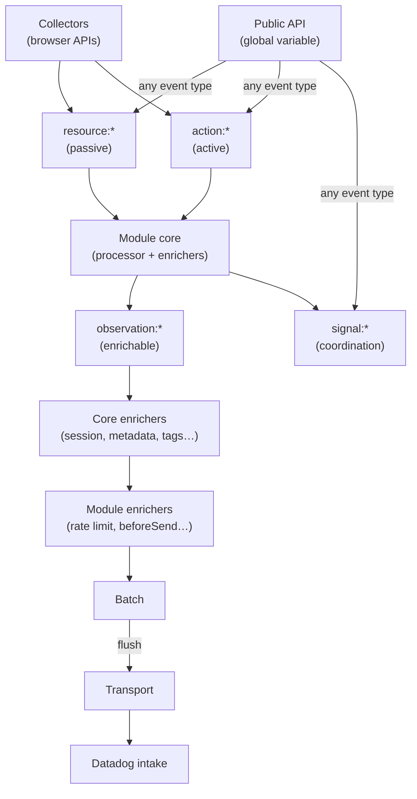

# Architecture v8

Documents the new SDK architecture being built in the `*-next` packages.

## Core principles

- **Environment-agnostic core** — `core-next` has zero browser dependencies. Browser-specific I/O lives in `browser-core-next`.
- **Modules, not packages** — RUM, Logs, and other products are modules loaded into a single SDK, not standalone packages.
- **Pipeline-based processing** — events flow through an enricher chain (DAG-ordered) before reaching the transport.
- **Classes allowed** — `*-next` packages use class-based architecture for interface implementations (unlike legacy packages).
- **Every event is timestamped** — all events published to the pipeline carry both a monotonic clock (`startTime`) and a wall clock (`startDate`). Publishers set both when they know exactly when the event occurred. A timestamp enricher registered on `*` fills in defaults for events that don't.

## Overall architecture

```
Developer app
  import '@datadog/browser-logs-next'           ← public API entrypoint
  import '@datadog/browser-views-next'          ← public API entrypoint
        │
        │  window.DD_SDK.logs.logger.info(...)
        │  window.DD_SDK.views.startView(...)
        │  → publishes any event type to pipeline
        │
        ▼
┌──────────────────────────────────────────────────────────────────┐
│                          SDK CORE                                │
│                                                                  │
│   pipeline · session · transport · batch · contexts              │
│                                                                  │
│   always bundled:                                                │
│   import '@datadog/browser-errors-next/collectors'              │
│   import '@datadog/browser-network-next/collectors'             │
│   import '@datadog/browser-console-next/collectors'             │
│   import '@datadog/browser-views-next/collectors'               │
│                    │                                             │
│                    │  publish resource:* / action:*              │
│                    ▼                                             │
│               [ pipeline ]           ◄── action:* / signal:*    │
│                                          from public API        │
└──────────────────────────────────────────────────────────────────┘
                       │
     dynamically loaded when config key detected:
     import('@datadog/browser-logs-next/processor')
     import('@datadog/browser-views-next/processor')
     import('@datadog/browser-rum-next/processor')
                       │
                       ▼
┌──────────────────────────────────────────────────────────────────┐
│                    MODULE PROCESSORS                             │
│                                                                  │
│  browser-logs-next/processor    browser-views-next/processor     │
│  ───────────────────────────    ─────────────────────────────    │
│  processor + enrichers          processor + enrichers            │
│  resource:* → observation:log   resource:navigation →            │
│                                 observation:view                 │
│                                 signal:view_changed              │
└──────────────────────────────────────────────────────────────────┘
```

## Module entrypoints

Every module has three distinct entrypoints, each a separate import path in the package.

```
@datadog/browser-logs-next/collectors   ← captures data from the environment
@datadog/browser-logs-next/processor    ← transforms data into observations
@datadog/browser-logs-next             ← public API (developer-facing)
```

### 1. `/collectors`

Listens to browser environment events (DOM events, `PerformanceObserver`, monkey-patched globals) and publishes raw data to the pipeline. No opinion on what the data means — just capture and forward.

**Key rules:**

- Save original references before patching (avoid infinite loops)
- Publish raw data — enrichers and processors handle normalization
- Return a `stop()` function that restores originals and removes listeners
- No imports from processor or public API entrypoints

**Collectors are bundled directly in the SDK core** because they are lightweight and must always run, regardless of which processors are active. The exception is collectors with large footprints (e.g., Session Replay, Profiling) — those ship alongside their own processor.

```ts
// Pattern
function startNavigationCollection(pipeline: Pipeline): () => void {
  const originalPushState = history.pushState.bind(history)
  history.pushState = (...args) => {
    originalPushState(...args)
    pipeline.publish('resource:navigation', { url: location.href, startTime: performance.now(), ... })
  }
  return () => { history.pushState = originalPushState }
}
```

### 2. `/processor`

**Loaded dynamically** when the SDK detects the module's config key. Contains:

- **Processor** — subscribes to `resource:*` and `action:*` events, transforms them into `observation:*` events. This is where raw data gets domain meaning.
- **Enrichers** — registered on `resource:*` or `observation:*` events. Add computed fields (e.g., `viewId`, `referrer`, `loadingType`), enforce rate limits, or discard events.

```
resource:navigation  ──► [navigationEnricher]  ──► { ...resource, viewId }
                                                           │
                                                    [processor]
                                                           │
                                               observation:view + signal:view_changed
```

Enrichers registered by the SDK core (in order):

On all `*` events:

1. `timestampEnricher` — fills in `startTime` / `startDate` if the publisher did not set them

On all `observation:*` events: 2. `metadataEnricher` — `date`, `source`, `service` 3. `sessionEnricher` — `session: { id }` (discards if session expired) 4. `internalContextEnricher` — `_dd: { format_version, browser_sdk_version }` 5. `tagsEnricher` — `ddtags` 6. `anonymousUser` — `usr.anonymous_id` (if `trackAnonymousUser`)

Module-specific enrichers are registered after the core ones (e.g., `rateLimitEnricher` on `observation:log`).

### 3. Default (public API)

The public API is a global variable bridge — what the developer calls in their application. Connects to the pipeline by publishing any event type: `action:*`, `signal:*`, `resource:*`, or `observation:*`.

```ts
// window.DD_SDK.views.startView('checkout')
//   → pipeline.publish('action:start_view', { name: 'checkout', ... })
```

Follows a bridge-class pattern: a class instantiated when the processor is loaded that receives a callback wired to `pipeline.publish(...)` and exposes user-facing methods. The SDK attaches it to the global under `sdk[module.name]`.

## Package structure

Each module is organized around its three entrypoints:

| Import path                               | Entrypoint            | Loaded by                       |
| ----------------------------------------- | --------------------- | ------------------------------- |
| `@datadog/browser-{name}-next/collectors` | Collectors            | SDK core — always bundled       |
| `@datadog/browser-{name}-next/processor`  | Processor + enrichers | SDK — dynamically on config key |
| `@datadog/browser-{name}-next`            | Public API            | Developer — static import       |

> **Exception:** Large collector modules (Session Replay, Profiling) ship alongside their own processor rather than being bundled in the SDK core.

## Initialization

The user calls a single `init()` with a flat config. Module keys drive which module cores are loaded dynamically:

```ts
window.DD_SDK.init({
  clientToken: 'abc',
  site: 'datadoghq.com',
  rum: { applicationId: 'xyz', trackUserInteractions: true },
  logs: { forwardErrorsToLogs: true },
})
```

- The presence of a module key (e.g. `rum: { ... }`) triggers dynamic loading of that module's core.
- An empty object (e.g. `rum: {}`) is enough to activate a module with defaults.
- If a module key is absent, the module core is not loaded. Collectors still run.

### Module loading strategy (open decision)

Two approaches are under consideration:

- **Code splitting** — modules are part of the same bundle but lazy-loaded via dynamic `import()`. Simpler for developers, standard bundler feature, full type safety at compile time.
- **Remote loading** — modules are separate scripts fetched from a CDN at runtime. More powerful for customers (true pay-for-what-you-use), but requires versioning infrastructure and more complex error handling.

Both are compatible with the configuration design. The loading mechanism is an implementation detail that can be decided later.

## Configuration

Configuration is assembled at init time by merging a base config with each module's validated slice.

### Base configuration (`core-next`)

Fields every SDK needs:

```ts
interface BaseInitConfiguration {
  clientToken: string
  site: string
  enabled?: boolean // replaces trackingConsent — defaults to true
  sessionSampleRate?: number
  env?: string
  service?: string
  version?: string
}
```

`enabled: false` means events are collected but not sent. When absent, defaults to `true`.

### Module configuration — TypeScript module augmentation

Each module extends `SdkInitConfiguration` via TypeScript module augmentation. Importing a module automatically adds its config fields to the init type:

```ts
// core-next defines the base — must be an interface, not a type alias
interface SdkInitConfiguration {
  clientToken: string
  site: string
  enabled?: boolean
  // ...
}

// @datadog/rum-next augments it when imported:
declare module '@datadog/core-next' {
  interface SdkInitConfiguration {
    rum?: RumInitConfiguration
  }
}

// User code:
import '@datadog/rum-next' // augments the type as a side-effect

sdk.init({
  clientToken: 'abc',
  rum: { applicationId: 'xyz' }, // TypeScript knows about 'rum'
})
```

Benefits:

- `browser-sdk` never needs to know about module config types
- Config changes only require updating the module package — no `browser-sdk` rebuild coupling
- If a module isn't imported, its fields don't exist in the type
- Each module owns its config definition completely

**Constraint:** `SdkInitConfiguration` must remain an `interface` in `core-next` — module augmentation does not work with `type` aliases.

### Module extensions

Each module provides a `ConfigExtension` that validates its own slice:

```ts
interface ConfigExtension<TKey extends string, TInit, TConfig> {
  key: TKey
  validate(init: TInit | undefined): TConfig | null // null = invalid, abort init
}
```

`buildConfiguration` assembles the final config and returns `null` if any extension fails validation.

## Data pipeline

### Base event shape

Every event published to the pipeline — regardless of category — carries two timestamps:

```ts
interface BaseEvent {
  startTime: number // performance.now() at the moment the event occurred
  startDate: number // Date.now() at the moment the event occurred
}
```

**Why both?**

- `startTime` (`performance.now()`) is monotonic and high-precision. It gives reliable ordering and duration measurements.
- `startDate` (`Date.now()`) is the absolute wall clock. Comparing the delta between consecutive `startDate` values against the delta between `startTime` values reveals when the monotonic clock froze — e.g. when the device was suspended. Without `startDate`, there is no way to detect that gap.

**Who sets them?**

Publishers (collectors, public API) set both timestamps at the moment the event occurs — not when `publish()` is called. This is the most accurate representation of when the thing happened.

A `timestampEnricher` registered on `*` acts as a safety net: if a publisher omits either field, the enricher fills it in with `performance.now()` / `Date.now()` at processing time. This ensures no event reaches the rest of the pipeline without timestamps.

```ts
// Correct — publisher sets timestamps at event time
window.addEventListener('error', (e) => {
  pipeline.publish('resource:runtime_error', {
    startTime: e.timeStamp,           // when the error occurred
    startDate: timeStampToDate(e.timeStamp),
    message: e.message,
    ...
  })
})

// Also valid — enricher fills in if omitted
pipeline.publish('action:log', { message: 'hello', status: 'info' })
// → timestampEnricher adds startTime + startDate
```

### Event taxonomy

The pipeline carries five categories of data, each with different semantics:

**Resource** — passive data points captured from browser APIs (navigation events, fetch/XHR completions, performance entries). Raw and minimal. Published by collectors.

**Action** — data points published intentionally — either by collectors responding to user gestures (clicks, taps), or by the public API (e.g. `startView()`, `logger.info()`). May accumulate child events before becoming an observation.

**Observation** — the step before a final event. Enrichable. Only observations go through the enricher chain and become serialized events sent to Datadog. This is what `beforeSend` receives after enrichment.

**Signal** — internal SDK coordination (`signal:session_expired`, `signal:view_changed`, `signal:page_exit`). No enrichment, instant delivery. Never serialized to the backend. Used for cross-module coordination.

**Telemetry** — SDK internal reporting (debug, error, usage, configuration). Fast track — separate from the ordered pipeline. Never blocked by stuck domain events.

### Event lifecycle



### Mapping from current SDK events

| Current event                     | v8 category | Rationale                                               |
| --------------------------------- | ----------- | ------------------------------------------------------- |
| **RUM events**                    |             |                                                         |
| `RESOURCE`                        | Resource    | Passive network data from browser APIs                  |
| `ACTION`                          | Action      | User-initiated interactions                             |
| `VIEW`                            | Observation | Enrichable page lifecycle data with accumulated metrics |
| `ERROR`                           | Observation | Enrichable runtime failures                             |
| `LONG_TASK`                       | Observation | Enrichable performance bottlenecks                      |
| `VITAL`                           | Observation | Enrichable custom measurements                          |
| **Lifecycle events**              |             |                                                         |
| `SESSION_EXPIRED`                 | Signal      | Internal coordination for session cleanup               |
| `SESSION_RENEWED`                 | Signal      | Internal coordination for session refresh               |
| `VIEW_CREATED`                    | Signal      | Internal coordination for view context                  |
| `VIEW_UPDATED`                    | Signal      | Internal coordination for view metrics                  |
| `VIEW_ENDED`                      | Signal      | Internal coordination for view termination              |
| `ACTION_STARTED`                  | Signal      | Internal coordination for action lifecycle              |
| `AUTO_ACTION_COMPLETED`           | Signal      | Internal coordination for action completion             |
| `REQUEST_STARTED`                 | Signal      | Internal coordination for request lifecycle             |
| `REQUEST_COMPLETED`               | Signal      | Internal coordination for resource fetch completion     |
| `PAGE_MAY_EXIT`                   | Signal      | Internal coordination for page unload                   |
| `RAW_RUM_EVENT_COLLECTED`         | Signal      | Pipeline entry point (replaced by `pipeline.publish()`) |
| `RUM_EVENT_COLLECTED`             | Signal      | Pipeline exit point (replaced by subscribers)           |
| `RAW_ERROR_COLLECTED`             | Signal      | Error pipeline entry (replaced by `pipeline.publish()`) |
| `VITAL_STARTED`                   | Signal      | Internal coordination for vital lifecycle               |
| **Internal observables**          |             |                                                         |
| `sessionStateUpdateObservable`    | Signal      | Session state synced across tabs                        |
| `locationChangeObservable`        | Signal      | URL/history navigation detected                         |
| `domMutationObservable`           | Signal      | DOM mutation detected                                   |
| `windowOpenObservable`            | Signal      | `window.open()` called                                  |
| `pageActivityObservable`          | Signal      | Meta-signal combining DOM/network/user activity         |
| `contextManager.changeObservable` | Signal      | Global/user/account context changed                     |
| `trackViews.stopObservable`       | Signal      | View tracking stopped                                   |
| `errorObservable`                 | Signal      | Error collected from any source                         |
| `flushObservable`                 | Signal      | Batch flush triggered                                   |
| `trackingConsentObservable`       | —           | Removed in v8 (replaced by `enabled` in config)         |
| **Telemetry**                     |             |                                                         |
| `LOG` (error/debug)               | Telemetry   | SDK diagnostic logs                                     |
| `CONFIGURATION`                   | Telemetry   | SDK init config snapshot                                |
| `USAGE`                           | Telemetry   | Public API call tracking                                |

### Pipeline tracks

The pipeline supports multiple tracks with different processing guarantees:

| Track       | Ordering               | Enrichers        | Use case                                         |
| ----------- | ---------------------- | ---------------- | ------------------------------------------------ |
| **ordered** | Sequential, guaranteed | Async or sync    | Observations — view before action                |
| **fast**    | None                   | Synchronous only | Telemetry — must never wait behind a stuck event |

Collectors publish to a specific track. Fast-track events bypass the ordered queue entirely — a stuck enricher cannot block telemetry signals.

### Enricher chain

DAG-ordered enrichers transform observations into events. Each enricher can:

- Return enriched data — chain continues
- Return `SKIP` — enricher and its dependents are bypassed, event still reaches subscribers
- Return `DISCARD` — event is dropped entirely

### Batch

Accumulates serialized messages, emits a `flush` event when size/count/timeout limits are hit. Browser-core hooks `visibilitychange`/`beforeunload` to trigger flush on exit.

### Transport

Pluggable interface — `browser-core` provides `HttpTransport` (fetch + beacon + retry). Any environment can provide its own implementation.

## Telemetry

Telemetry signals (errors, usage, debug) are published to the pipeline's **fast track**. This guarantees:

- Telemetry is never blocked by stuck RUM/log events
- No ordering requirements — a telemetry error doesn't need to wait for the current view
- Enrichers on the fast track must be synchronous — no async that could hang

Context (session ID, service, version) is provided by synchronous context providers registered specifically for the telemetry track.

> **TODO:** The fast track requires pipeline changes not yet implemented. Until then, telemetry uses its own internal queue.

## Tracking consent

Replaced by `enabled` in the configuration. No separate consent state machine.

- `enabled: true` (default) — collect and send events
- `enabled: false` — collect events but do not send
