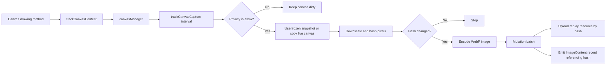

# Session Replay canvas recording

Canvas recording is experimental. It captures Canvas 2D, WebGL 1, and WebGL 2 content as image resources and references those resources from the Session Replay record stream.

## Enable canvas recording

Canvas recording requires both the experimental feature flag and the canvas recording option:

```ts
datadogRum.init({
  // ...
  sessionReplaySampleRate: 100,
  enableExperimentalFeatures: ['session_replay_record_canvas'],
  sessionReplayCanvasRecording: {
    enable: true,
    quality: 'medium',
  },
  defaultPrivacyLevel: 'allow',
})
```

Canvas pixels are captured only when the canvas's effective privacy level is `allow`. Session Replay defaults to `mask`, so do not rely on the default when testing canvas recording. See [Session Replay Privacy Options](https://docs.datadoghq.com/session_replay/privacy_options/?platform=browser&tab=as-wrappers).

Setting `defaultPrivacyLevel: 'allow'` allows all page content to be recorded. To allow only a specific canvas, keep the restrictive page default and override the element instead:

```html
<canvas data-dd-privacy="allow"></canvas>
```

## Quality presets

`medium` is used when `quality` is omitted.

| Quality  | Maximum frames/s | Hash dimension | Image dimension | WebP quality |
| -------- | ---------------- | -------------- | --------------- | ------------ |
| `low`    | 1                | 50 px          | 600 px          | 0.3          |
| `medium` | 4                | 100 px         | 1000 px         | 0.5          |
| `high`   | 8                | 100 px         | 1280 px         | 0.75         |

Image and hash dimensions are maximum dimensions. Aspect ratio is preserved and smaller canvases are not enlarged.

## Capture pipeline



1. [`trackCanvasContent`](../trackers/trackCanvasContent.ts) instruments drawing methods and marks canvases dirty. Non-preserved WebGL contexts also store a frozen snapshot in the [`canvasManager`](./canvasManager.ts).
2. [`trackCanvasCapture`](../trackers/trackCanvasCapture.ts) runs at the configured frame rate and takes the dirty canvases from the manager.
3. The capture uses a frozen WebGL snapshot when available. Otherwise it copies and downscales the live canvas.
4. A smaller thumbnail is hashed. Unchanged images are not encoded or emitted again.
5. Changed images are encoded as WebP and queued as canvas content mutations.
6. [`serializeMutations`](../serialization/serializeMutations.ts) uploads the image resource and emits an `ImageContent` change referencing its hash.
7. [`replayResourceCollection`](../../segmentCollection/replayResourceCollection.ts) deduplicates uploads by hash and retries a canvas if its queued resource is discarded.

## Canvas 2D

Canvas 2D change detection is event-driven, while image capture is scheduled. The SDK instruments the bitmap-changing methods on `CanvasRenderingContext2D` and marks the associated canvas dirty after a successful call. This includes rectangle, path, text, image, pixel, focus, and reset operations. Multiple draws between capture ticks therefore cost only dirty-state updates and are coalesced into one candidate frame.

Canvas elements are also marked dirty when they are serialized in a full snapshot or an added subtree, because their pixels are not represented by the DOM snapshot. Removing a canvas invalidates its per-node capture state. Assigning `width` or `height` resets the browser bitmap even when the value does not change, so the mutation tracker invalidates the previous bitmap state and the serializer schedules a fresh capture.

On each configured capture tick, the canvas manager drains dirty, connected, non-tainted canvases that do not already have a capture in flight. After checking that the node is part of the replay and has an effective privacy level of `allow`, the capture tracker:

1. Copies the live bitmap into one immutable, size-limited snapshot.
2. Hashes a smaller thumbnail together with the original canvas dimensions.
3. Stops if that hash matches the last frame emitted for the canvas.
4. Encodes a changed snapshot as WebP and queues a canvas content mutation.

Mutation serialization checks the node and its privacy level again, emits an `ImageContent` change containing the hash, and sends the image through the independent replay-resource request queue. Resource uploads are deduplicated by hash; a frame rejected because the queue is full marks the canvas dirty so it can be captured again.

## WebGL

WebGL uses the same canvas manager, capture, hashing, encoding, mutation, and resource-upload pipeline as Canvas 2D. The difference is when the pixels must be copied.

The SDK instruments the core drawing-buffer methods rather than wrapping `HTMLCanvasElement.getContext()`, so contexts created before Session Replay starts are still observable. WebGL 1 instruments `clear`, `drawArrays`, and `drawElements`. WebGL 2 exposes those operations on its own prototype and adds framebuffer blits, typed buffer clears, instanced draws, and ranged element draws, so both the inherited WebGL 1 methods and the additional WebGL 2 methods are instrumented on `WebGL2RenderingContext`.

After a drawing call succeeds, the handling depends on `context.getContextAttributes()?.preserveDrawingBuffer`.

### Preserved drawing buffers

When `preserveDrawingBuffer` is `true`, the browser keeps the drawing buffer available. Drawing methods only mark the canvas dirty, and the regular capture scheduler copies the live canvas later, exactly as it does for Canvas 2D.

### Non-preserved drawing buffers

When `preserveDrawingBuffer` is `false`, the browser may discard the drawing buffer after compositing. Waiting for the regular capture interval could therefore produce an empty image.

After an instrumented drawing method returns:

1. The tracker checks whether enough time has passed according to the selected quality preset.
2. If eligible, it reserves the sampling slot immediately.
3. It schedules an unawaited Promise callback.
4. The microtask rechecks privacy and freezes a size-limited snapshot while the drawing buffer is still available.
5. The snapshot is stored in the canvas manager and the canvas is marked dirty once it belongs to the replay tree.

Multiple drawing calls in the same task are coalesced, so the microtask captures their final result. Sampling remains bounded to 1, 4, or 8 snapshots per second. At the next capture tick, the normal pipeline hashes and encodes this frozen snapshot instead of reading the potentially discarded live buffer.

This is best-effort sampling: a final draw performed during the cooldown may not replace the previous snapshot if the application does not draw again. Content rendered before canvas tracking starts also cannot be recovered after the browser has discarded it.

### Lifecycle details

- A newly inserted canvas can draw before DOM mutation serialization assigns its node ID. The tracker freezes the pixels immediately; serializing the added subtree later marks it dirty.
- Removing a canvas invalidates its capture attempt and hash but preserves its latest frozen snapshot, so reinserting or reparenting the same element does not require another WebGL draw.
- Full snapshots start a new record stream. Per-stream hashes, queued mutations, and capture attempts are reset, while the latest frozen WebGL snapshot is preserved so a static canvas does not start empty.
- Canvas resize handling has two phases. A WebGL draw at new dimensions bypasses the previous bitmap's sampling cooldown. Mutation observation then invalidates the old bitmap state before the delayed mutation batch, and serialization marks the canvas dirty without deleting a WebGL snapshot created after the resize.
- A stale asynchronous capture cannot update a canvas after it is removed, reset, or moved to a new stream because every capture attempt carries a stream-bound identity check.
- A canvas that throws a `SecurityError` while its pixels are copied is marked as tainted and is not retried until recording restarts.

## Scope and limitations

- Core WebGL 1 and WebGL 2 drawing-buffer methods are instrumented.
- Optional drawing extensions such as `ANGLE_instanced_arrays` and `WEBGL_multi_draw` are not instrumented.
- `OffscreenCanvas` rendering in workers is not supported.
- Canvas resources use the replay intake independently from replay segment uploads.
