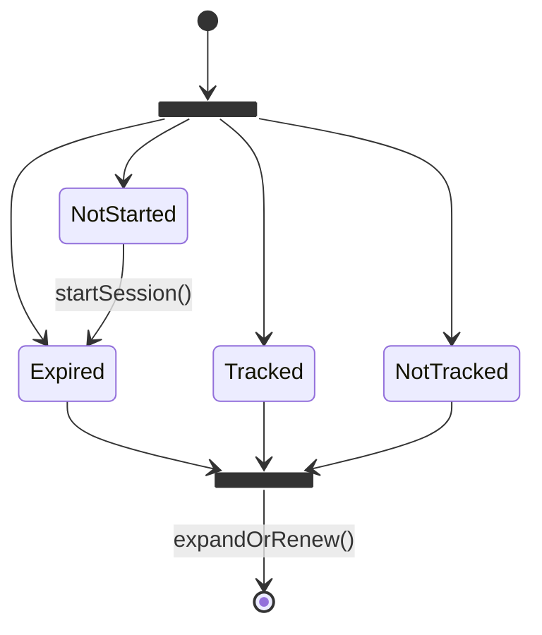
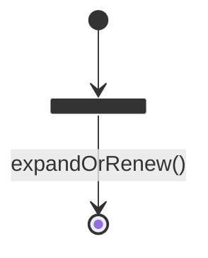
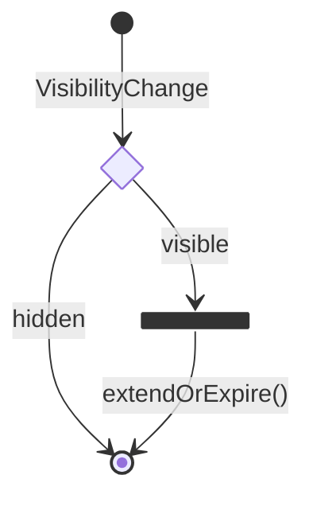
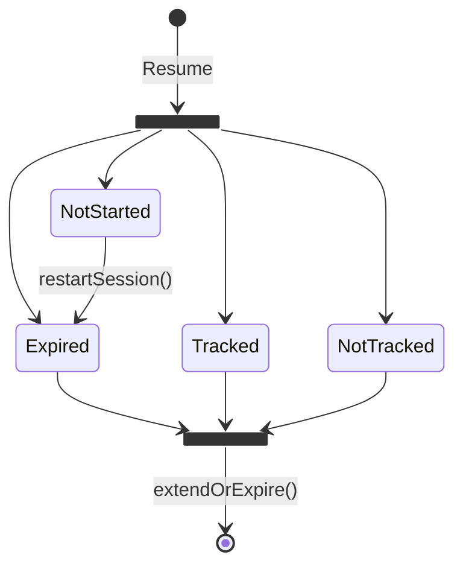
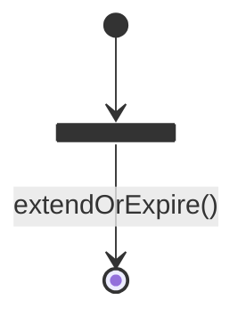
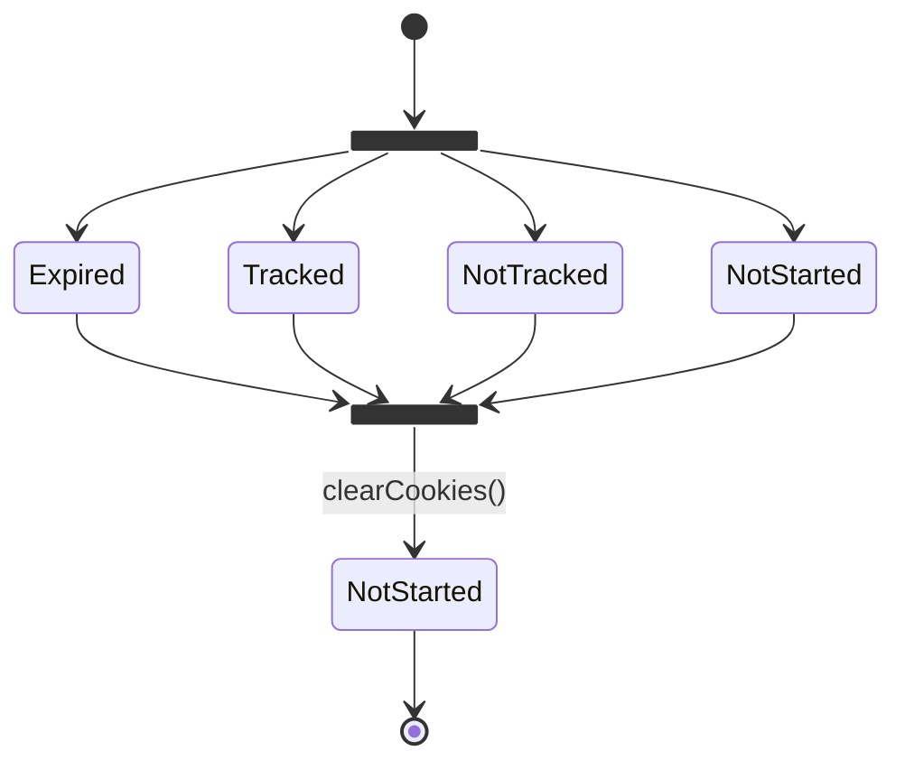
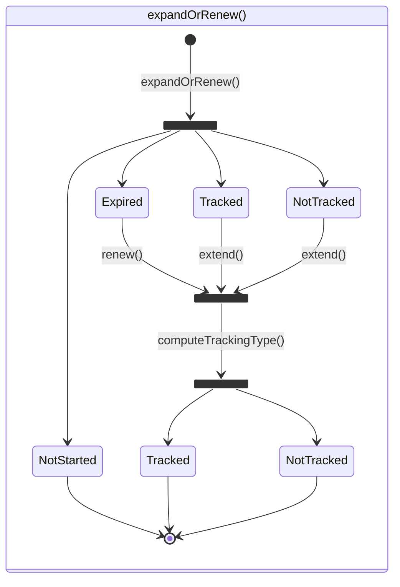
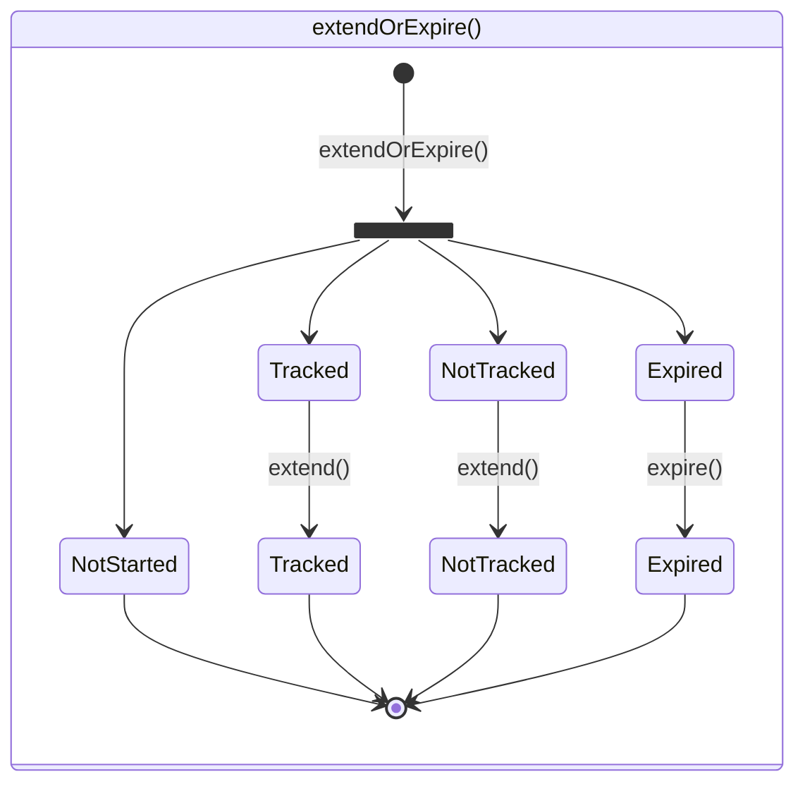

## possible states:

| state                   | value                                                        |
| ----------------------- | ------------------------------------------------------------ |
| NotStarted\* | `{}`                                                         |
| Expired                 | `{expired: '1'}` or `expire >  15 minutes` or `created > 4H` |
| Tracked                 | `{id: 'xxxx-xx-xx}`                                          |
| NotTracked              | `{rum: 0}` or `{logs: 0}`                                    |

(\*) `NotStarted` is a state that can happen in a few different ways:

- First load of the page if there is no cookie present already
- After the cookie has been deleted by a 3rd party (user, ad blocker, ...)
- After the cookie has expired (it is deleted by the browser)

Other terminology:

- A _started_ session is a session that is either `Expired`, `Tracked`, or `NotTracked`.
- An _active_ session is a session that is either `Tracked` or `NotTracked`.

## start session

## On User Activity

## On Visibility Change

## On resume from frozen state

## Watch (every second)

## 3rd party cookie clearing

## Expand Or Renew

> [!NOTE]  
> Because `computeTrackingType()` happens at every `expandOrRenew()`, it is in theory possible to switch from `Tracked` to `NotTracked` and vice versa within an active session. However, this is not expected to happen in practice at this time.

## Extend Or Expire

> [!NOTE]  
> Because a session time out can result in an `Expired` state, `expire()` explicitly normalizes the state to `isExpired=1`
