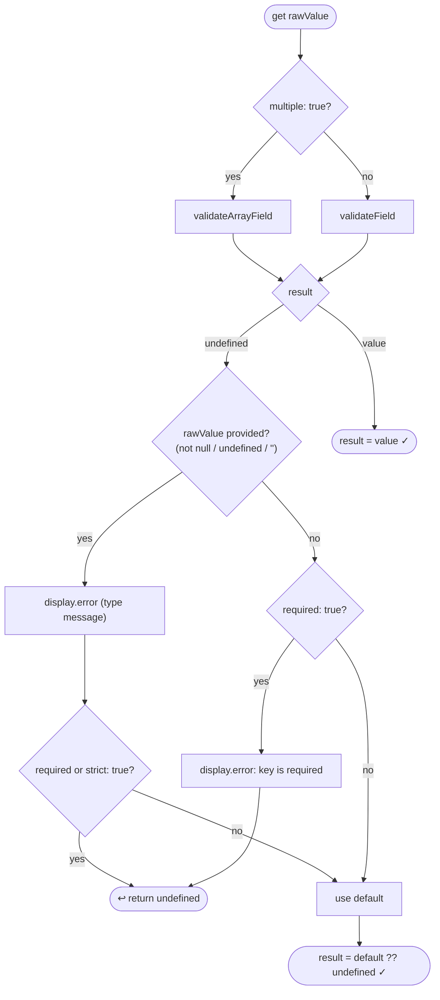
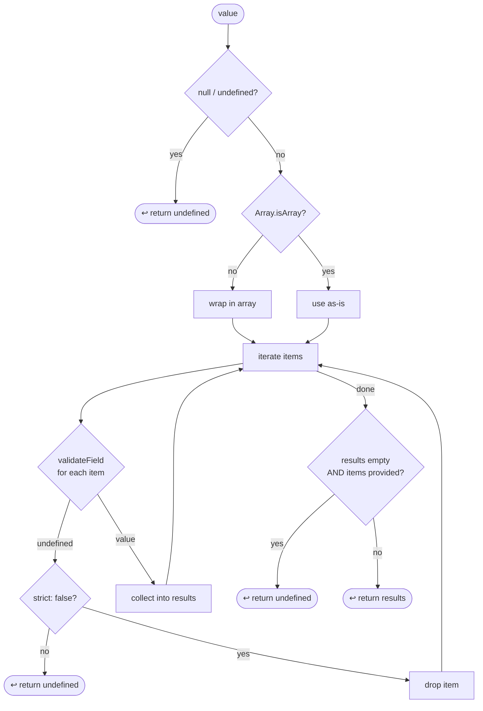

# `@datadog/js-core/configuration` — Validation Engine

`validateAndBuildConfiguration(initConfig, schema, display?)` iterates over every key in the schema,
validates the raw value from `initConfig`, and builds the final configuration object. If any field
produces a hard failure the whole function returns `undefined`.

---

## Per-field decision flow

---

## Scalar field behaviour — full comparison table

**Legend:** _value_ = use provided value · _default_ = use field default · _abort_ = config fails · _`!!v`_ = boolean coercion

Empty string `""` is special-cased as "not provided" for all types — it never triggers an error or
strict abort; the field silently falls through to its default.

<table>
  <thead>
    <tr>
      <th rowspan="2">Type</th>
      <th rowspan="2">Valid value</th>
      <th rowspan="2">Absent <small>(null / undefined / "")</small></th>
      <th colspan="2">strict: true <em>(default)</em></th>
      <th colspan="2">strict: false</th>
    </tr>
    <tr>
      <th>Invalid</th>
      <th>Notes</th>
      <th>Invalid</th>
      <th>Notes</th>
    </tr>
  </thead>
  <tbody>
    <tr>
      <td><code>string</code></td>
      <td><em>value</em></td>
      <td><em>default</em></td>
      <td><strong>abort</strong></td>
      <td>not a string, or <code>""</code></td>
      <td><em>default</em></td>
      <td><code>""</code> treated as absent — no error</td>
    </tr>
    <tr>
      <td><code>percentage</code></td>
      <td><em>value</em></td>
      <td><em>default</em></td>
      <td><strong>abort</strong></td>
      <td>not a number, or outside 0–100</td>
      <td><em>default</em></td>
      <td></td>
    </tr>
    <tr>
      <td><code>boolean</code></td>
      <td><em>value</em></td>
      <td><em>default</em></td>
      <td><strong>abort</strong></td>
      <td>non-boolean</td>
      <td><em><code>!!v</code></em></td>
      <td>⚠️ coerces, does <strong>not</strong> fall back to default</td>
    </tr>
    <tr>
      <td><code>site</code></td>
      <td><em>value</em></td>
      <td><em>default</em></td>
      <td><strong>abort</strong></td>
      <td>string not matching Datadog site pattern</td>
      <td><em>default</em></td>
      <td></td>
    </tr>
    <tr>
      <td><code>match-option</code></td>
      <td><em>value</em></td>
      <td><em>default</em></td>
      <td><strong>abort</strong></td>
      <td>not string / RegExp / function</td>
      <td><em>default</em></td>
      <td></td>
    </tr>
    <tr>
      <td><code>enum</code> (array form)</td>
      <td><em>value</em></td>
      <td><em>default</em></td>
      <td><strong>abort</strong></td>
      <td>string not in <code>values</code> list</td>
      <td><em>default</em></td>
      <td></td>
    </tr>
    <tr>
      <td><code>enum</code> (object form)</td>
      <td><em>value</em></td>
      <td><em>default</em></td>
      <td><strong>abort</strong></td>
      <td>string not among object's values</td>
      <td><em>default</em></td>
      <td></td>
    </tr>
    <tr>
      <td><code>function</code></td>
      <td><em>value</em></td>
      <td><em>default</em></td>
      <td><strong>abort</strong></td>
      <td>non-function</td>
      <td><em>default</em></td>
      <td></td>
    </tr>
    <tr>
      <td><code>schema</code></td>
      <td><em>nested config</em></td>
      <td><em>default</em></td>
      <td><strong>abort</strong></td>
      <td>non-object, or required inner field missing/invalid</td>
      <td><em>default</em></td>
      <td></td>
    </tr>
    <tr>
      <td><code>union</code></td>
      <td><em>first matching variant</em></td>
      <td><em>default</em></td>
      <td><strong>abort</strong></td>
      <td>no variant matches</td>
      <td><em>default</em></td>
      <td></td>
    </tr>
  </tbody>
</table>

> `boolean strict:false` is the only type that **coerces** rather than falling back to default.
> All other types either accept the value or treat it as absent.

---

## `multiple: true` — `validateArrayField`

### `multiple: true` behaviour by case

| Case                            | `strict` | Result                      | Config outcome         |
| ------------------------------- | -------- | --------------------------- | ---------------------- |
| `null` / `undefined`            | any      | `undefined`                 | use default            |
| Explicit `[]`                   | any      | `[]`                        | use `[]` (not default) |
| Single non-array value, valid   | any      | `[value]`                   | use `[value]`          |
| Single non-array value, invalid | true     | `undefined`                 | abort                  |
| Single non-array value, invalid | false    | `undefined` (all-filtered)  | use default            |
| Array, all items valid          | any      | `[...values]`               | use `[...values]`      |
| Array, some items invalid       | true     | `undefined` (first invalid) | abort                  |
| Array, some items invalid       | false    | `[valid items]`             | use partial array      |
| Array, all items invalid        | true     | `undefined` (first invalid) | abort                  |
| Array, all items invalid        | false    | `undefined` (all-filtered)  | use default            |

> **Key distinction:** explicit `[]` always returns `[]` regardless of `strict`.  
> "All invalid" returns `undefined` (triggering the default) only when items _were_ provided but all failed validation.

### `enum + allowAll: true` (only valid with `multiple: true`)

When `allowAll: true` is set, the string `'all'` is accepted as a shorthand and expanded to the
full set of enum values before any per-item validation runs.

---

## Field modifiers reference

| Modifier         | Type    | Default | Effect                                                                                                                                          |
| ---------------- | ------- | ------- | ----------------------------------------------------------------------------------------------------------------------------------------------- |
| `required: true` | boolean | `false` | If the validated value is `undefined` and no value was provided, abort with "key is required".                                                  |
| `default: value` | any     | —       | Value used when validation yields `undefined` and the field is absent or `strict: false`.                                                       |
| `multiple: true` | boolean | `false` | Run `validateArrayField` instead of `validateField`; normalises a single value to a singleton array.                                            |
| `strict: false`  | boolean | `true`  | When a provided value fails validation, fall back to the default instead of aborting. Exception: `boolean strict:false` coerces with `!!value`. |
| `allowAll: true` | boolean | `false` | `enum` + `multiple` only. Accepts the string `'all'` as shorthand for the full value set.                                                       |
