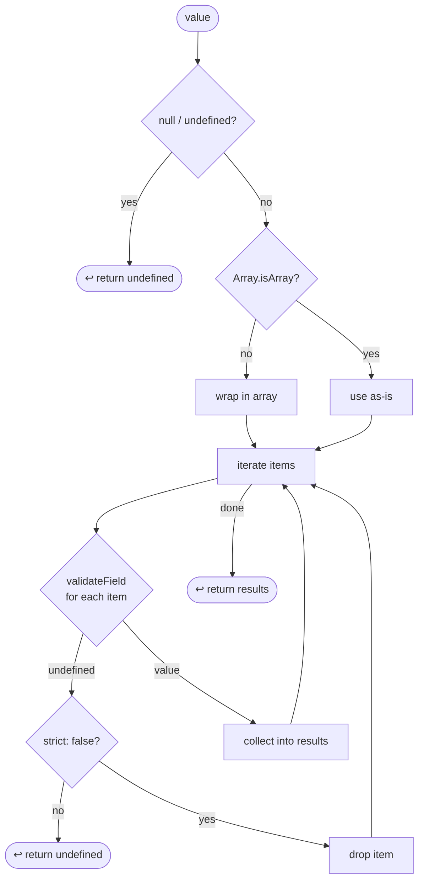

# `@datadog/js-core/configuration` — Validation Engine

`validateAndBuildConfiguration(initConfig, schema, display?)` iterates over every key in the schema,
validates the raw value from `initConfig`, and builds the final configuration object. If any field
produces a hard failure the whole function returns `undefined`.

---

## Per-field decision flow


---

## What `validateField` returns per type

`validateField` returns either a valid value or `undefined`. There is no hard-abort sentinel —
`undefined` always means "invalid or absent", and the outer loop decides what to do based on
`strict` and `required`.

| Type                 | `null` / `undefined` | Valid value                            | Invalid value                                             |
| -------------------- | -------------------- | -------------------------------------- | --------------------------------------------------------- |
| `string`             | `undefined`          | the string                             | `undefined` (not a string, or empty `""`)                 |
| `percentage`         | `undefined`          | the number                             | `undefined` (not a number, or outside 0–100)              |
| `boolean`            | `undefined`          | the boolean                            | `undefined` (not a boolean); `!!value` if `strict: false` |
| `site`               | `undefined`          | the string                             | `undefined` (not a Datadog site domain)                   |
| `match-option`       | `undefined`          | the value (string / RegExp / function) | `undefined`                                               |
| `enum` (array form)  | `undefined`          | the string                             | `undefined` (not in the list)                             |
| `enum` (object form) | `undefined`          | the string                             | `undefined` (not a known value)                           |
| `custom`             | passed to `validate` | whatever `validate` returns            | `undefined` (validator returns `undefined`)               |

---

## `multiple: true` — `validateArrayField`



Key behaviours:

- A **single non-array value** is silently normalised to `[value]` — no error.
- An invalid item with `strict: true` (default) propagates `undefined` immediately — the whole field fails.
- An invalid item with `strict: false` is dropped; remaining items continue.
- An all-invalid array with `strict: false` returns `[]`, not `undefined` — the `default` path is not triggered.

---

## Field modifiers

| Modifier         | Type    | Default | Effect                                                                                               |
| ---------------- | ------- | ------- | ---------------------------------------------------------------------------------------------------- |
| `required: true` | boolean | `false` | If the validated value is `undefined`, abort with "key is required".                                 |
| `default: value` | any     | —       | Value used when validation yields `undefined` (and `strict: false` or value was absent).             |
| `multiple: true` | boolean | `false` | Run `validateArrayField` instead of `validateField`; normalises a single value to a singleton array. |
| `strict: false`  | boolean | `true`  | When a provided value fails validation, fall back to the default instead of aborting.                |

### `strict` in detail

`strict` applies whenever `validateField` returns `undefined` **and** the raw value was actually
provided (not `null`, `undefined`, or `""`).

```
provided value → validateField → undefined
  strict: true  (default) → display.error + abort
  strict: false            → display.error + use default
```

For `multiple: true` fields the same rule applies per item:

```
invalid item → validateField → undefined
  strict: true  (default) → abort the whole field immediately
  strict: false            → drop the item, continue
```

---

## Empty string handling for `string` fields

Empty string `""` is special-cased as "not provided" so it never triggers the strict abort.
It silently falls through to the default, preserving backward-compatible behaviour for optional
string fields that may receive `""`.

| raw value   | `validateField` result | treated as "provided"? | outcome                                           |
| ----------- | ---------------------- | ---------------------- | ------------------------------------------------- |
| `undefined` | `undefined`            | no                     | use default                                       |
| `null`      | `undefined`            | no                     | use default                                       |
| `""`        | `undefined`            | **no**                 | use default (no error)                            |
| `"foo"`     | `"foo"`                | —                      | use `"foo"`                                       |
| `123`       | `undefined`            | yes                    | error + abort (strict) or default (strict: false) |

`required: true` string fields still reject `""` — `validateField` returns `undefined`, and
since `""` is not counted as "provided", the required check fires ("key is required", abort).
